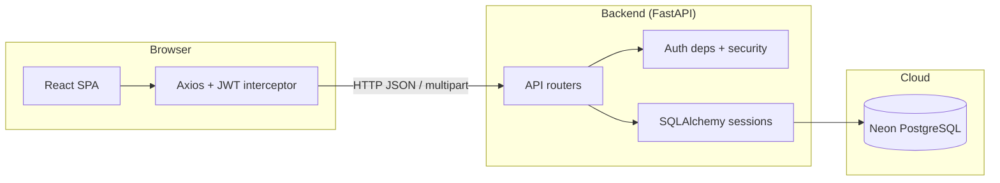
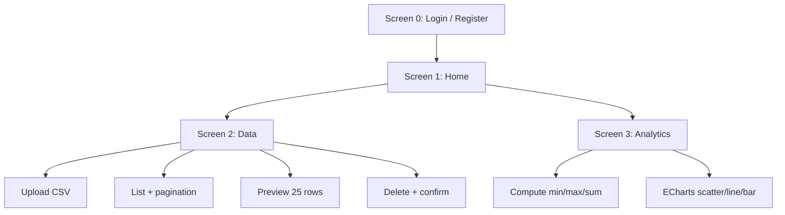
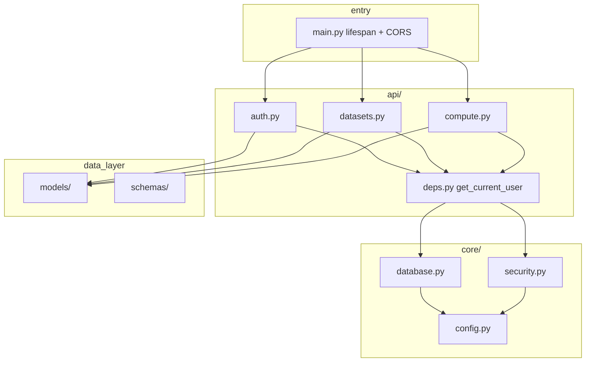
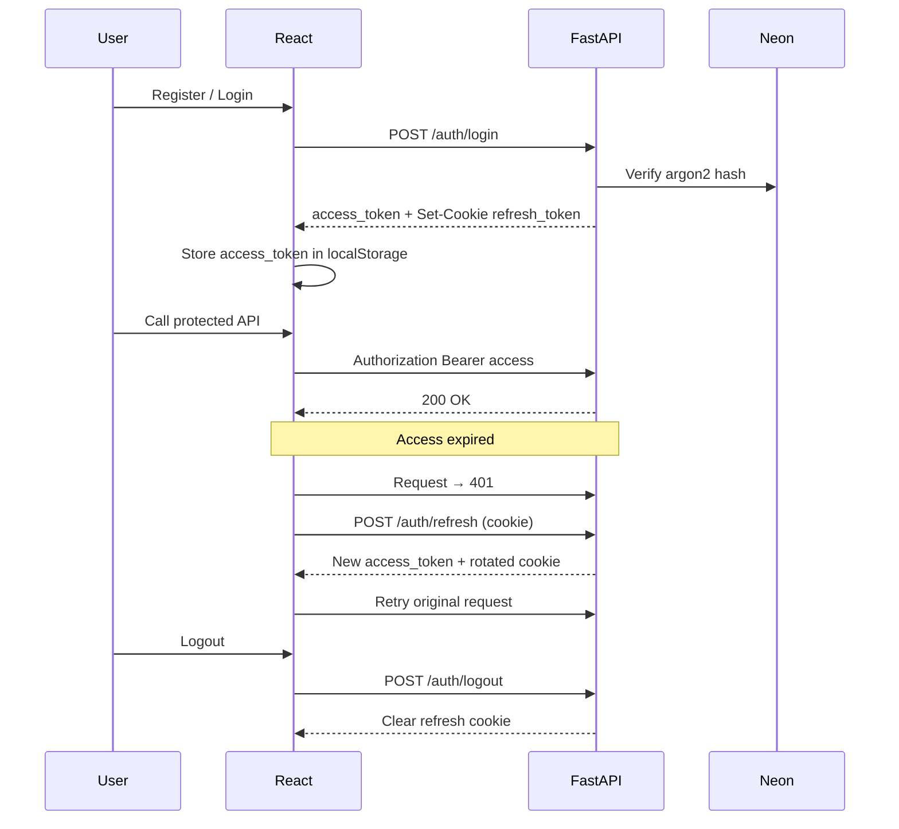
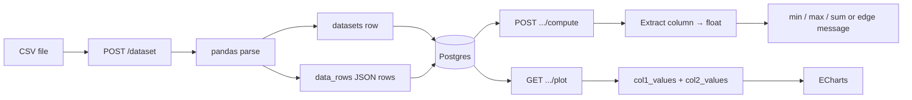
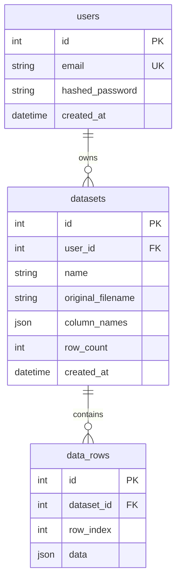
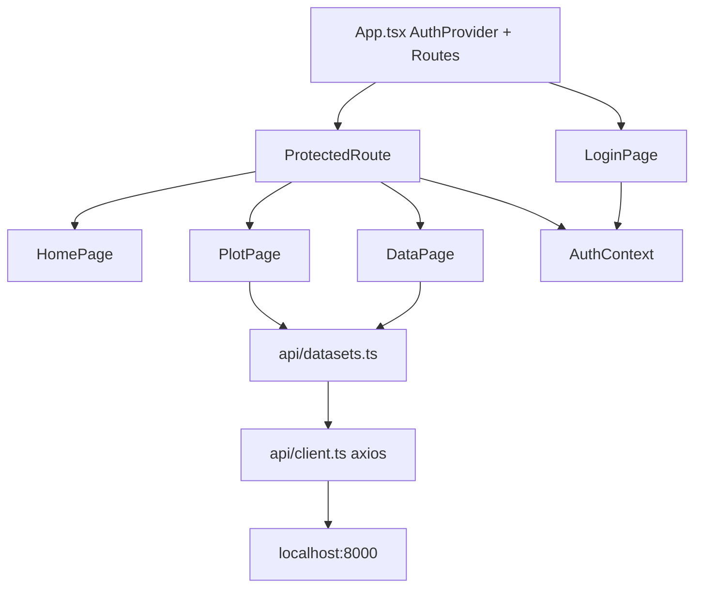

# DataBoard — Architecture

## System overview

---

## Screens ↔ features

---

## Backend layers

**Request path (protected):**

1. Router receives request  
2. `Depends(get_current_user)` → Bearer JWT → user row  
3. `Depends(get_db)` → SQLAlchemy session (closed after response)  
4. Handler runs business logic + commit  

---

## Auth sequence

---

## Upload & compute data flow

---

## Database schema

Design notes:

- Flexible CSV schemas via JSON row documents  
- Cached `column_names` / `row_count` avoid full scans for list UI  
- Deleting a dataset cascades to all `data_rows`

---

## Frontend structure

---

## Concurrency model (interview note)

This take-home uses **sync** FastAPI handlers + sync SQLAlchemy:

- Uvicorn still runs an ASGI server; sync routes run in a threadpool when needed  
- Connection pooling: `pool_size=5`, `max_overflow=10`, `pool_pre_ping=True`  
- CSV parsing is CPU-bound and runs in the request thread (acceptable for small sample CSVs)  

Async (`asyncpg`) was deferred as a stretch goal — see [assumptions.md](./assumptions.md).
